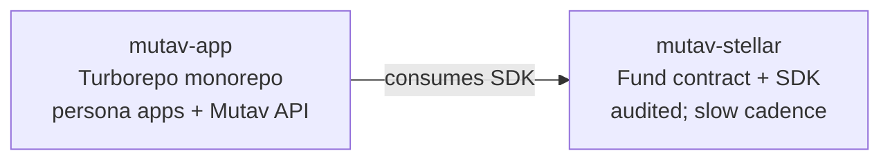

# MUTAV Stellar — Protocol Layer

The **Stellar protocol layer** for MUTAV Finance: the audited `Fund` Soroban contract + the TypeScript SDK that consumers use to read chain state and compose transactions. Part of the NearX acceleration program.

> *Contrato Soroban auditado + SDK TypeScript do MUTAV. Programa de aceleração NearX.*

## Scope

> **Note on terminology**: in this repo "contract" means a Soroban smart contract (Rust). On `mutav-app` the same word refers to rental contracts (lease agreements between agencies and tenants). "Admin" similarly: here = Stellar admin keypair; on `mutav-app` = the `(admin)` shell signed by a hardware wallet. See `docs/architecture/01-protocol-overview.md#terminology` for the full table.

This repo houses two surfaces, both kept under strict change control because a bug here moves money:

- **Rust contract** (`contracts/`) — audit-gated, slow change cadence, the smallest changeable thing in the system.
- **TS SDK** (`src/`) — published as `@mutav-finance/mutav-stellar`. Read-oriented; composes chain reads and produces transaction XDRs for consumers to sign. Holds no keys.

UI and operator-runtime code live on `mutav-app` by design (see [the two-repo split](#the-two-repo-split) below).

## The two-repo split

The protocol is delivered across two repos, separated by audit surface and change cadence (consolidated 2026-05-30 per [`#57`](https://github.com/mutav-finance/mutav-stellar/issues/57)):



| Repo | Stack | Audience | Why separate |
|---|---|---|---|
| **`mutav-stellar`** (here) | Rust + Bun | Protocol team | Audited contract; tight change control; no UI, no operator keys |
| [`mutav-finance/mutav-app`](https://github.com/mutav-finance/mutav-app) | Next.js 16 + Convex + Turborepo | Agencies, investors, protocol-team admin | Web surface (persona apps on `*.mutav.finance`) + **Mutav API** (Convex backend) + the KMS-backed Convex Actions that hold operator authority |

Dependency: `mutav-app` consumes this repo's SDK; the direction does not reverse. The standalone [`mutav-fund`](https://github.com/mutav-finance/mutav-fund) web3 portal soft-deprecates into `mutav-app/apps/fund/` as part of the monorepo migration ([`mutav-fund#11`](https://github.com/mutav-finance/mutav-fund/issues/11)).

**Boundary rule** — *custody-locality claim, not a system-wide security guarantee*: this repo's deployment is the on-chain contract + the published SDK. Operator and admin authority live on `mutav-app` (KMS-backed Convex Action and hardware wallet inside `apps/admin/` respectively); end-user custody (agencies, investors) is wallet-held and out of scope here. See [`02-actors-and-trust.md`](./docs/architecture/02-actors-and-trust.md) for the full trust model — including off-chain routing surfaces (e.g. the agency app displaying which address agencies pay) that a compromised consumer could still affect without touching any key.

**Trade-offs** of the split: SDK release coordination + cross-repo CI gates between `mutav-stellar` and `mutav-app`. These are real costs; the benefit (audit-gating only the contract surface) is the trade we accept.

## Docs

Architecture: [`docs/architecture/`](./docs/architecture/) — start with the README inside. Decisions: [`docs/architecture/decisions/`](./docs/architecture/decisions/). Target-state diagram: [`docs/architecture/diagrams/target-state.excalidraw.json`](./docs/architecture/diagrams/target-state.excalidraw.json).

Protocol-wide strategy, whitepaper, and brand assets live in [`mutav-finance/mutav`](https://github.com/mutav-finance/mutav).

## Stack

- **Stellar (Soroban / Rust)** — smart contracts
- **Bun + TypeScript** — SDK

## Setup

```bash
git clone https://github.com/mutav-finance/mutav-stellar.git
cd mutav-stellar
git config core.hooksPath .githooks
```

See [CONTRIBUTING.md](./CONTRIBUTING.md) for branch workflow and PR guidelines.

## License

Apache-2.0. See [LICENSE](./LICENSE) and [NOTICE](./NOTICE).
