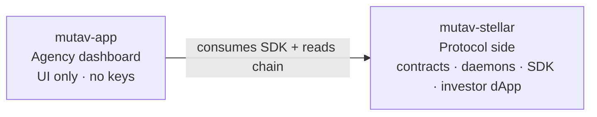

# MUTAV Stellar — Protocol

The **protocol side** of MUTAV Finance: Soroban smart contracts, operator daemons, TypeScript SDK, and (forthcoming) investor dApp. Part of the NearX acceleration program.

> *Lado de protocolo do MUTAV: contratos Soroban, daemons do operador, SDK em TypeScript e (em breve) dApp do investidor. Programa de aceleração NearX.*

## Scope

This repo houses everything that requires **operator or admin authority**, plus the public investor surface:

- **Smart contracts** (`contracts/`) — the `Fund` Soroban contract
- **TS SDK** (`src/`) — typed interface to the contract, consumed by all UIs
- **Operator daemons** (`src/jobs/`, in flight) — on-ramp, off-ramp, yield-sync, mgmt-fee, heartbeat, ttl-watchdog
- **Investor dApp** (forthcoming) — public-facing UI for deposit / redeem / NAV view; signs client-side via wallet

The **agency dashboard** lives in a sibling repo, [`mutav-finance/mutav-app`](https://github.com/mutav-finance/mutav-app), which depends on this repo's SDK and never holds operator/admin keys.



## Docs

Architecture: [`docs/architecture/`](./docs/architecture/) — start with the README inside.

Protocol-wide strategy, whitepaper, and brand assets live in [`mutav-finance/mutav`](https://github.com/mutav-finance/mutav).

## Stack

- **Stellar (Soroban / Rust)** — smart contracts
- **Bun + TypeScript** — SDK + operator daemons
- **Frontend** — TBD (investor dApp; likely Next.js)

## Setup

```bash
git clone https://github.com/mutav-finance/mutav-stellar.git
cd mutav-stellar
git config core.hooksPath .githooks
```

See [CONTRIBUTING.md](./CONTRIBUTING.md) for branch workflow and PR guidelines.

## License

Apache-2.0. See [LICENSE](./LICENSE) and [NOTICE](./NOTICE).
