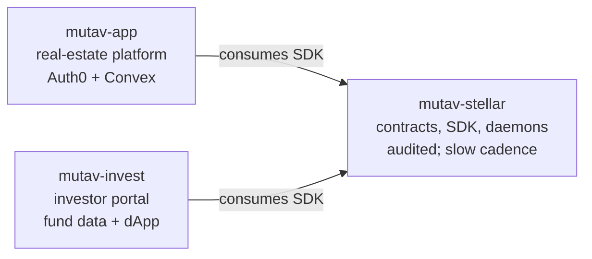

# MUTAV Stellar — Contracts + Infrastructure

The **Stellar contracts and operator infrastructure** for MUTAV Finance. Part of the NearX acceleration program.

> *Contratos Stellar e infraestrutura do operador do MUTAV. Programa de aceleração NearX.*

## Scope

This repo houses the **audited surface** of the protocol — everything that needs strict change control because a bug here moves money. By design, the UI surfaces live in sibling repos.

- **Smart contracts** (`contracts/`) — the `Fund` Soroban contract
- **TS SDK** (`src/`) — typed interface to the contract, published as `@mutav-finance/mutav-stellar` and consumed by both sibling apps
- **Operator daemons** (`src/jobs/`, in flight) — on-ramp, off-ramp, yield-sync, mgmt-fee, heartbeat, ttl-watchdog. Hold the operator key.
- **Admin tooling** — scripts and runbooks for cold-wallet operations

## The three-repo split

The protocol is delivered across three repos, separated by audit surface and change cadence:



| Repo | Stack | Audience | Why separate |
|---|---|---|---|
| **`mutav-stellar`** (here) | Rust + Bun | Protocol team | Audited contracts; tight change control; no UI |
| [`mutav-finance/mutav-app`](https://github.com/mutav-finance/mutav-app) | Auth0 + Convex | Real-estate agencies | Web2 SaaS for rental-contract management + agency payment flows |
| `mutav-finance/mutav-invest` (forthcoming) | TBD (Next.js + wallet) | Investors | Public dApp; fund data, deposit/redeem, KYC if required |

Dependency: both sibling repos consume this repo's SDK; neither feeds back into it. **Operator/admin keys never leave this repo's deployment.**

## Docs

Architecture: [`docs/architecture/`](./docs/architecture/) — start with the README inside.

Protocol-wide strategy, whitepaper, and brand assets live in [`mutav-finance/mutav`](https://github.com/mutav-finance/mutav).

## Stack

- **Stellar (Soroban / Rust)** — smart contracts
- **Bun + TypeScript** — SDK + operator daemons

## Setup

```bash
git clone https://github.com/mutav-finance/mutav-stellar.git
cd mutav-stellar
git config core.hooksPath .githooks
```

See [CONTRIBUTING.md](./CONTRIBUTING.md) for branch workflow and PR guidelines.

## License

Apache-2.0. See [LICENSE](./LICENSE) and [NOTICE](./NOTICE).
