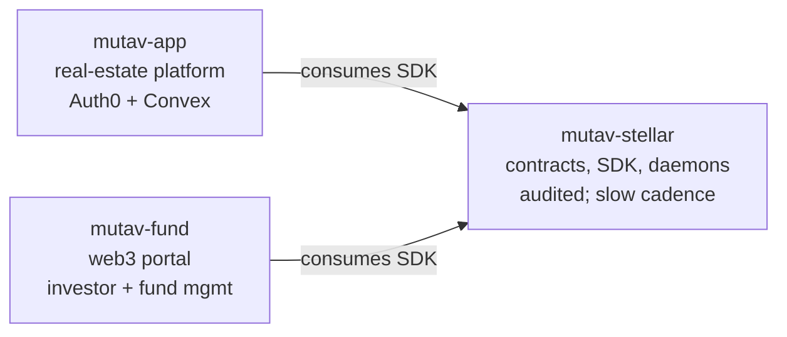

# MUTAV Stellar — Contracts + Infrastructure

The **Stellar contracts and operator infrastructure** for MUTAV Finance. Part of the NearX acceleration program.

> *Contratos Stellar e infraestrutura do operador do MUTAV. Programa de aceleração NearX.*

## Scope

> **Note on terminology**: in this repo "contract" means a Soroban smart contract (Rust). On `mutav-app` the same word refers to rental contracts (lease agreements between agencies and tenants). "Admin" similarly: here = Stellar admin keypair; on `mutav-app` = Auth0 staff role. See `docs/architecture/01-protocol-overview.md#terminology` for the full table.

This repo houses two distinct surfaces, both kept under strict change control because a bug here moves money:

- **Rust contract** (`contracts/`) — audit-gated, slow change cadence, the smallest changeable thing in the system. The "audited surface" proper.
- **TS SDK + operator daemons** (`src/`) — operator-authority code that holds keys and executes money flows. Not audited in the same sense the contract is; needs its own change-control regime (release tags, separate review bar).
- **Admin tooling** — scripts and runbooks for cold-wallet operations.

UI surfaces live in sibling repos by design.

## The three-repo split

The protocol is delivered across three repos, separated by audit surface and change cadence:



| Repo | Stack | Audience | Why separate |
|---|---|---|---|
| **`mutav-stellar`** (here) | Rust + Bun | Protocol team | Audited contracts; tight change control; no UI |
| [`mutav-finance/mutav-app`](https://github.com/mutav-finance/mutav-app) | Auth0 + Convex | Real-estate agencies | Web2 SaaS for rental-contract management + agency payment flows |
| [`mutav-finance/mutav-fund`](https://github.com/mutav-finance/mutav-fund) | Next.js 16 + Bun + Stellar wallet kit | Investors + protocol team (admin) | Web3 portal: investor flows (deposit/redeem/NAV/KYC) + fund management UI (dashboard, partner mgmt, parameter changes, `cover_default`). All wallet-signed. |

Dependency: both sibling repos consume this repo's SDK; neither feeds back into it.

**Boundary rule** — *custody-locality claim, not a security guarantee*: operator/admin custody never leaves `mutav-stellar`'s deployment. Agency and investor custody is end-user-owned and out of scope here. See [`02-actors-and-trust.md`](./docs/architecture/02-actors-and-trust.md) for the full trust model — including off-chain routing surfaces (e.g. `mutav-app` displaying which address agencies pay) that a compromised sibling could still affect without touching an operator key.

**Trade-offs** of three repos: SDK release coordination across siblings, multi-repo CI gates, fragmented onboarding for newcomers, harder cross-cutting refactors. These are real costs; the benefit (tight change control on the audited surface) is the trade we accept.

## Docs

Architecture: [`docs/architecture/`](./docs/architecture/) — start with the README inside.

Protocol-wide strategy, whitepaper, and brand assets live in [`mutav-finance/mutav`](https://github.com/mutav-finance/mutav).

## Stack

- **Stellar (Soroban / Rust)** — smart contracts
- **Bun + TypeScript** — SDK + operator daemons

## Setup

```bash
git clone https://github.com/mutav-finance/mutav-stellar.git
cd mutav-stellar
git config core.hooksPath .githooks
```

See [CONTRIBUTING.md](./CONTRIBUTING.md) for branch workflow and PR guidelines.

## License

Apache-2.0. See [LICENSE](./LICENSE) and [NOTICE](./NOTICE).
