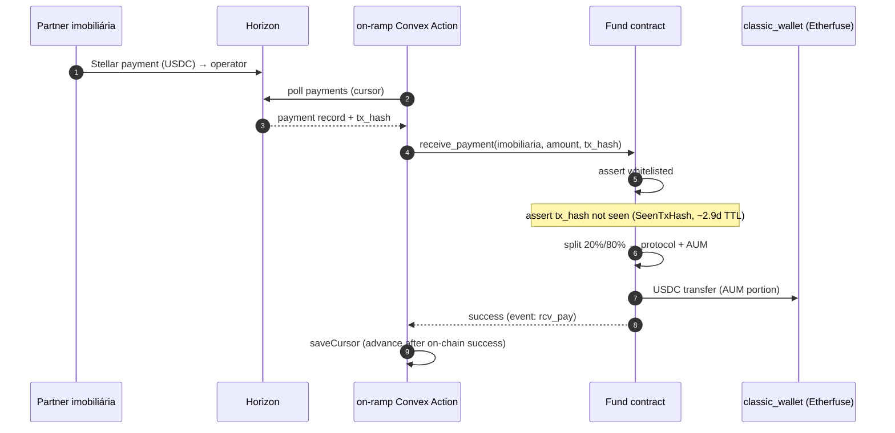
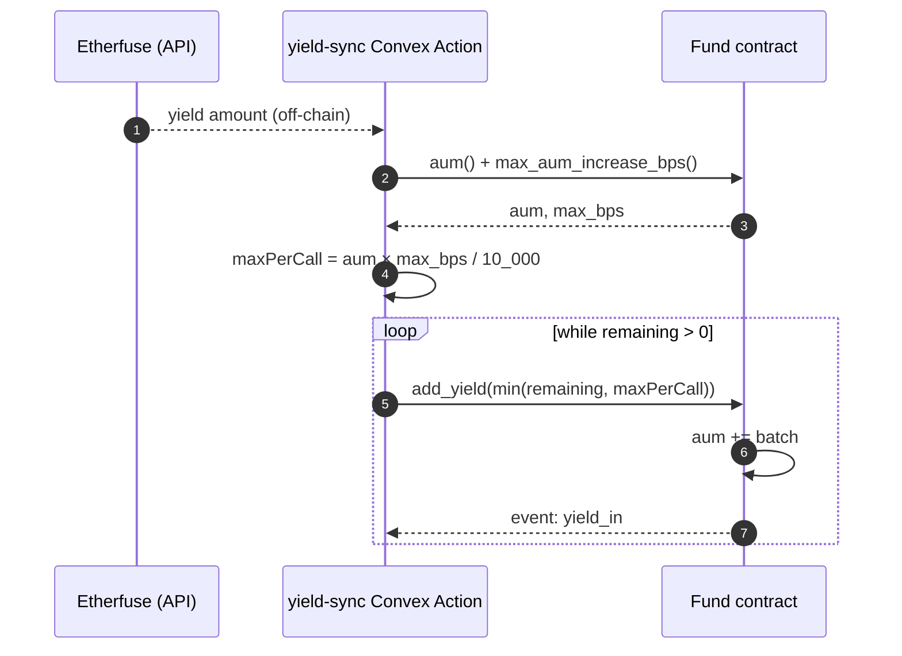
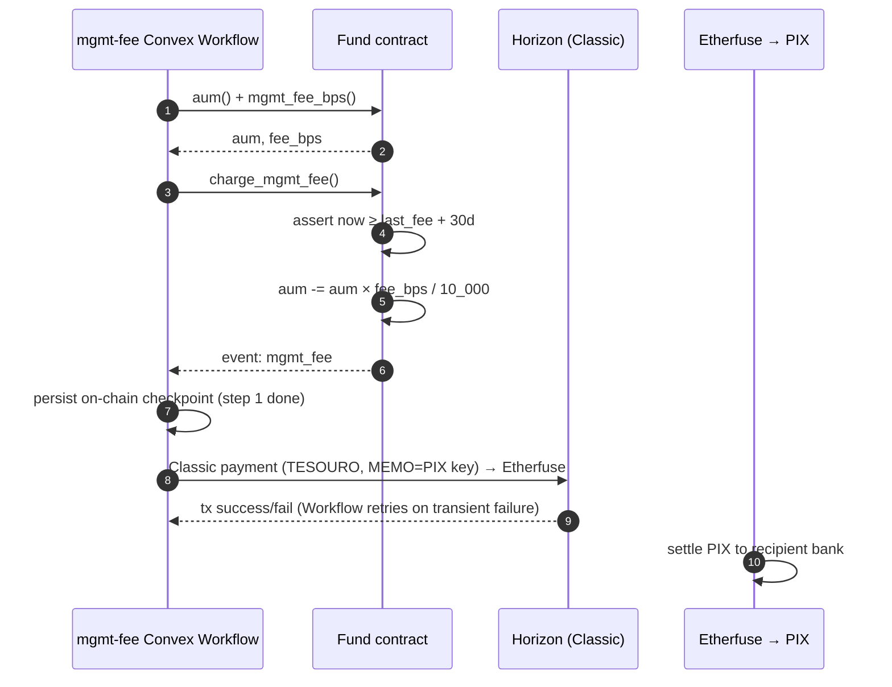
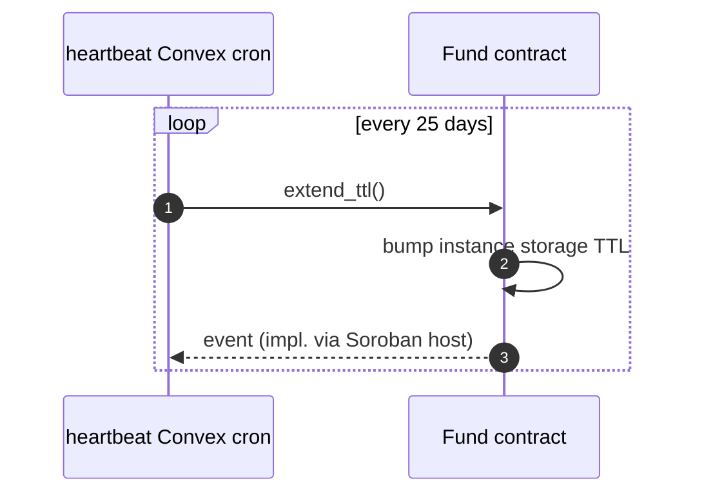
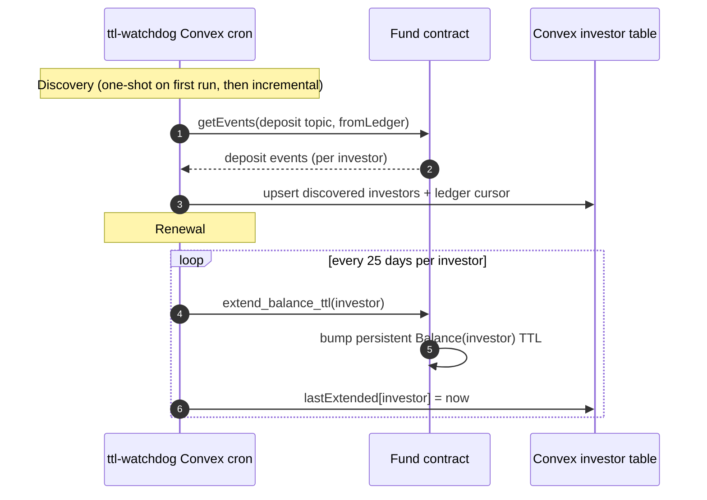

# 06 — Canonical flows

Five operational flows + two maintenance flows. Each diagram shows the actors that participate (contract, operator runtime, investor, etc.) and the order of events. Arrows are call/event boundaries.

> **Snapshot caveat**: flows described as of `main` at commit `90e1185`. After the [`#57`](https://github.com/mutav-finance/mutav-stellar/issues/57) consolidation (2026-05-30), the actor labelled "operator" in each flow is a **Convex Action on `mutav-app`** signing via KMS — see [`05-operational-layer.md`](./05-operational-layer.md). The flow logic, contract calls, and ordering are unchanged. PR-specific annotations (e.g. PR #22's replay-guard) refer to contract-side changes embedded in those PRs that may still land independently; see [`decisions/2026-05-30-daemon-prs-orphan-verdict.md`](./decisions/2026-05-30-daemon-prs-orphan-verdict.md) for the orphan disposition.

## Flow 1 — Partner payment ingress (on-ramp)

A partner agency pays the monthly guarantee fee in USDC to the operator address; the on-ramp Convex Action detects it and records it on-chain.



**Contract-side**: the on-chain replay guard (PR #22's `tx_hash` arg + `SeenTxHash(tx_hash)` in temporary storage) is part of the contract surface and should land independently of the Convex-Action move — see the orphan verdict. **Atomicity gap from the Bun design** (cursor advancing before on-chain success): resolved by Convex's atomic mutation semantics — the Action's mutation that bumps the cursor commits only after the contract call returns.

## Flow 2 — Investor deposit

```mermaid
sequenceDiagram
    autonumber
    participant I as Investor
    participant F as Fund contract
    participant CW as classic_wallet (Etherfuse)

    I->>F: deposit_investor(investor, amount_usdc)
    F->>F: require_auth(investor)
    F->>F: require_not_paused
    F->>F: calc_mint(amount × supply / aum)
    F->>I: pull USDC (token::transfer)
    F->>CW: forward USDC
    F->>I: mint MUTAV (balance += mutav_minted)
    F->>F: aum += amount; supply += mutav
    F-->>I: event: deposit
```

**NAV**: locked at this call's `aum/supply`. **Pause**: blocks deposit; investors can still cancel/reclaim existing redemptions.

## Flow 3 — Yield recording



**Cap**: `max_aum_increase_bps` per call. **Gap**: no per-period rolling cap → operator-compromise inflates NAV (issue #31).

## Flow 4 — Redemption (request → process → fulfill)

The most complex flow because it spans on-chain queue mechanics + off-chain liquidation + per-investor finalization.

```mermaid
sequenceDiagram
    autonumber
    participant I as Investor
    participant W as off-ramp Convex Workflow
    participant E as Etherfuse
    participant F as Fund contract

    Note over I: Day 0 — request
    I->>F: request_redemption(investor, mutav_amount)
    F->>F: lock MUTAV; append to RedemptionQueue
    F-->>I: event: req_rdmpt

    Note over W: Week N — process (step 1 of Workflow)
    W->>F: process_redemptions()
    F->>F: snapshot NAV; cap by weekly_exit
    F->>F: for each fitting: burn MUTAV, write ReadyRedemption(deadline)
    F-->>W: total_usdc + rdy_rdmpt events per investor
    W->>W: persist in-flight ready set (Workflow checkpoint)

    Note over W,E: Off-chain liquidation (step 2)
    W->>E: liquidate(total_usdc)
    E-->>W: USDC on operator address (wait, up to 24h)

    Note over W: Deposit + fulfill (step 3)
    W->>F: token transfer (USDC into contract)
    loop per investor (resumable from checkpoint)
        W->>F: fulfill_redemption(investor)
        F->>I: USDC transfer (gross - redemption_fee)
        F-->>W: event: fulfill
    end

    Note over I: Escape hatch
    I->>F: reclaim_expired_redemption(investor)
    F->>I: restore MUTAV (if deadline passed without fulfillment)
```

**Gap resolved by Convex Workflow durability** (previously a Bun-daemon gap from PR #23 review): if the Workflow crashes between `process_redemptions` and the per-investor `fulfill_redemption` loop, it resumes from the last persisted checkpoint. Investors are still racing the on-chain `deadline`, but the Workflow does not lose track of who's pending — the `reclaim_expired_redemption` escape hatch remains the contract-side safety net.

## Flow 5 — Monthly mgmt fee



**Atomic-split bug from the Bun-daemon design**: on-chain `charge_mgmt_fee` runs before the Classic payment; if Classic failed, AUM was debited but no fee shipped, and the 30-day guard blocked retry. **Resolved by Convex Workflow**: the on-chain debit and the off-chain Classic submission are two steps of the same Workflow; the Workflow persists between them and retries the off-chain submission on transient failure. A permanent off-chain failure (e.g. malformed PIX MEMO) becomes a Workflow-level error to surface to ops rather than silent AUM-debit-with-no-payout.

## Maintenance flow A — Contract instance TTL (heartbeat)



~30-day instance lease + 5-day safety margin = 25-day renewal cadence.

## Maintenance flow B — Investor balance TTL (ttl-watchdog)



**Gap from the Bun-daemon design** (PR #27 review): the prior cold-boot defaulted to a 24h lookback, silently dropping investors who deposited before that window. **Resolution under Convex**: the discovery cursor lives in a Convex table, not a JSON file on a single host, so there is no per-host cold boot. The first-ever run must still seed from ledger zero (or from the contract's deployment ledger); add an explicit bootstrap-from-deployment-ledger step in the Action rather than a lookback default.

## Cross-flow invariants

- All flows respect `paused` semantics (see [03-contract.md](./03-contract.md) for the matrix of what pause blocks).
- All flows that change AUM also emit a topic-tagged Soroban event. The future indexer (#44) consumes these for the audit log.
- The redemption queue is FIFO ordering of requests, but a second `request_redemption` from the same investor accumulates onto their existing entry (does NOT enqueue a new slot). Surfaces as a fairness consideration in issue #34.
