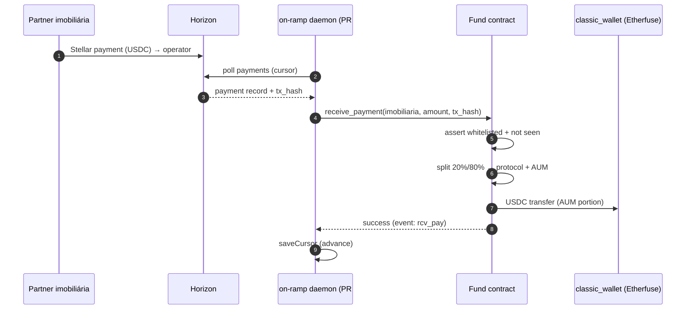
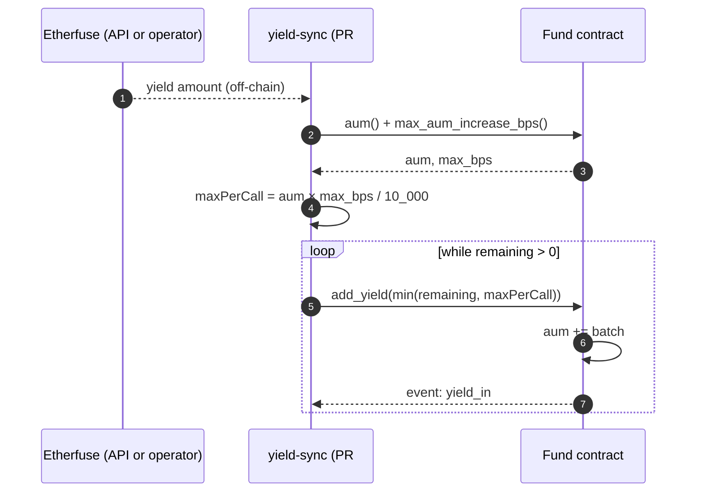
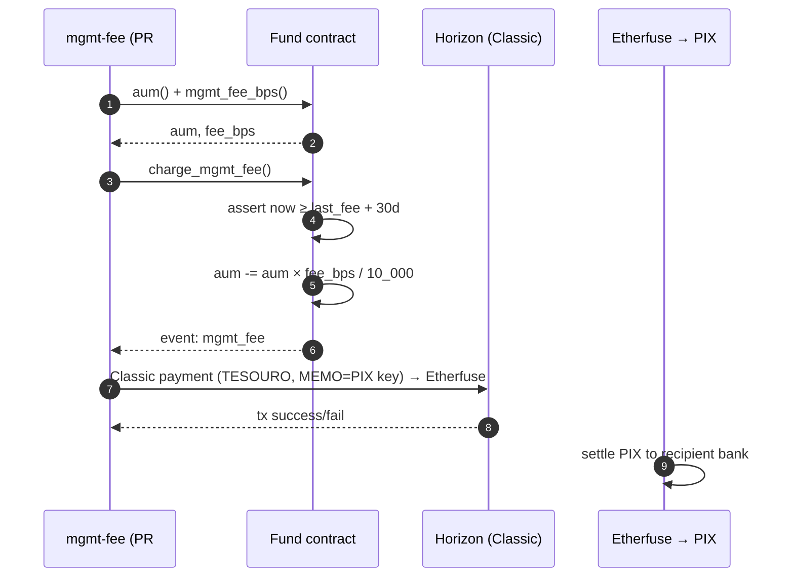
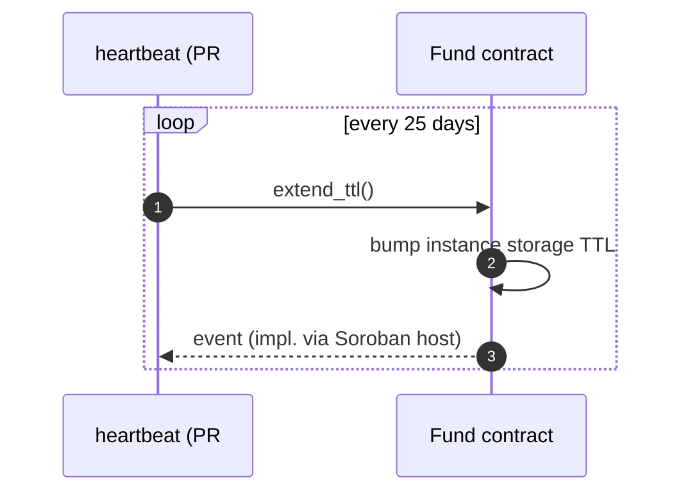
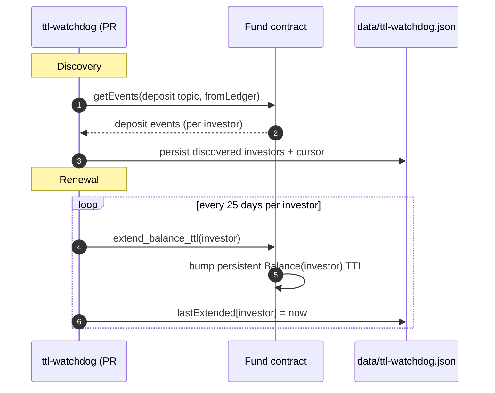

# 06 — Canonical flows

Five operational flows + two maintenance flows. Each diagram shows the actors that participate (contract, operator, investor, etc.) and the order of events. Arrows are call/event boundaries.

## Flow 1 — Partner payment ingress (on-ramp)

A partner agency pays the monthly guarantee fee in USDC to the operator wallet; the on-ramp daemon detects it and records it on-chain.



**Replay guard**: `SeenTxHash(tx_hash)` in temporary storage; TTL ~2.9 days. **Atomicity**: cursor must advance *after* on-chain success — currently broken (PR #22 review).

## Flow 2 — Investor deposit

```mermaid
sequenceDiagram
    autonumber
    participant I as Investor
    participant F as Fund contract
    participant CW as classic_wallet (Etherfuse)

    I->>F: deposit_investor(investor, amount_usdc)
    F->>F: require_auth(investor)
    F->>F: require_not_paused
    F->>F: calc_mint(amount × supply / aum)
    F->>I: pull USDC (token::transfer)
    F->>CW: forward USDC
    F->>I: mint MUTAV (balance += mutav_minted)
    F->>F: aum += amount; supply += mutav
    F-->>I: event: deposit
```

**NAV**: locked at this call's `aum/supply`. **Pause**: blocks deposit; investors can still cancel/reclaim existing redemptions.

## Flow 3 — Yield recording



**Cap**: `max_aum_increase_bps` per call. **Gap**: no per-period rolling cap → operator-compromise inflates NAV (issue #31).

## Flow 4 — Redemption (request → process → fulfill)

The most complex flow because it spans on-chain queue mechanics + off-chain liquidation + per-investor finalization.

```mermaid
sequenceDiagram
    autonumber
    participant I as Investor
    participant D as off-ramp (PR #23)
    participant E as Etherfuse
    participant F as Fund contract

    Note over I: Day 0 — request
    I->>F: request_redemption(investor, mutav_amount)
    F->>F: lock MUTAV; append to RedemptionQueue
    F-->>I: event: req_rdmpt

    Note over D: Week N — process
    D->>F: process_redemptions()
    F->>F: snapshot NAV; cap by weekly_exit
    F->>F: for each fitting: burn MUTAV, write ReadyRedemption(deadline)
    F-->>D: total_usdc + rdy_rdmpt events per investor

    Note over D,E: Off-chain liquidation
    D->>E: liquidate(total_usdc)
    E-->>D: USDC on operator wallet (wait, up to 24h)

    Note over D: Deposit + fulfill
    D->>F: token transfer (USDC into contract)
    loop per investor
        D->>F: fulfill_redemption(investor)
        F->>I: USDC transfer (gross - redemption_fee)
        F-->>D: event: fulfill
    end

    Note over I: Escape hatch
    I->>F: reclaim_expired_redemption(investor)
    F->>I: restore MUTAV (if deadline passed without fulfillment)
```

**Critical gap** (PR #23 review): if `D` crashes between `process_redemptions` and the per-investor `fulfill_redemption` loop, investors are stuck in `ReadyRedemption` until `deadline`, and the daemon has no resume logic. Needs a persisted in-flight state file (issue #38).

## Flow 5 — Monthly mgmt fee



**Critical gap**: on-chain `charge_mgmt_fee` runs **before** the Classic payment. If Classic fails, AUM is debited but no fee shipped — 30-day guard blocks retry. Manual reconciliation only. Needs reverse-order or persisted job ledger (issue #38, PR #26 review).

## Maintenance flow A — Contract instance TTL (heartbeat)



~30-day instance lease + 5-day safety margin = 25-day renewal cadence.

## Maintenance flow B — Investor balance TTL (ttl-watchdog)



**Critical gap** (PR #27 review): cold-boot defaults to a 24h lookback. Any investor who deposited before that window is silently dropped → their balance entry expires and funds become unrecoverable. Needs fail-fast or explicit seed (issue #38).

## Cross-flow invariants

- All flows respect `paused` semantics (see [03-contract.md](./03-contract.md) for the matrix of what pause blocks).
- All flows that change AUM also emit a topic-tagged Soroban event. The future indexer (#44) consumes these for the audit log.
- The redemption queue is FIFO ordering of requests, but a second `request_redemption` from the same investor accumulates onto their existing entry (does NOT enqueue a new slot). Surfaces as a fairness consideration in issue #34.
