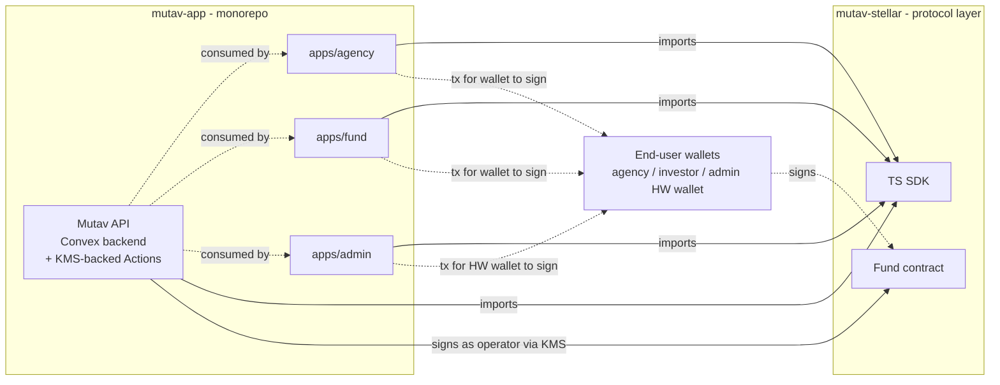
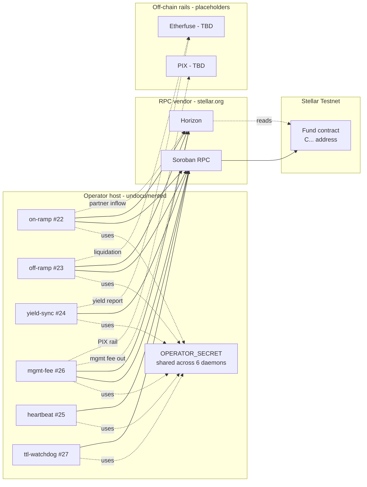
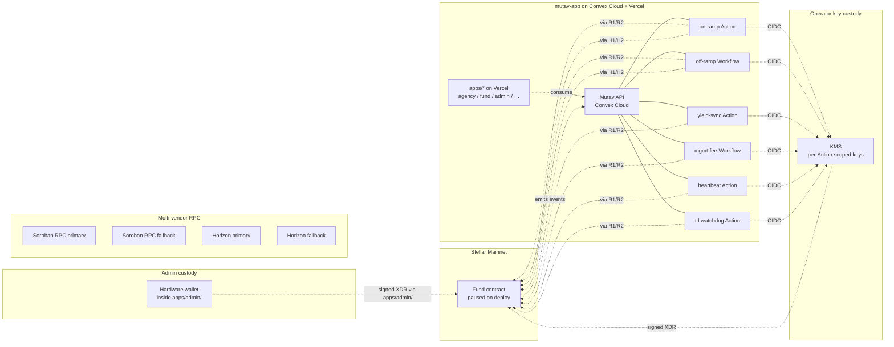

# 07 — Deployment topology

Where things run, today and in the target state. The current topology is testnet-grade; the mainnet target adds isolation, redundancy, and observability.

## Cross-repo topology

Two repos, one dependency direction. `mutav-app` consumes this repo's SDK. **Operator-key custody lives behind the KMS-backed Convex Actions on `mutav-app`**; admin authority lives in a hardware wallet inside `apps/admin/`; investor and agency authority is end-user-wallet-held. This repo's deployment is the on-chain contract + the published SDK — no signing keys.

## Current (testnet, snapshot 2026-05-29 — historical reference)

> **Historical**: this section describes the topology proposed by the now-orphaned daemon PRs (#22–#27). The 6 Bun daemons were never deployed; they were in-flight in unmerged PRs at the moment of the [`#57`](https://github.com/mutav-finance/mutav-stellar/issues/57) consolidation. Kept here so the pre-consolidation state is searchable; the live testnet today has only the contract + SDK from `main`.

### Pre-consolidation gaps (resolved or relocated by `#57`)

- **Keys**: a single `OPERATOR_SECRET` shared by all 6 daemons (#41) → **resolved-by-target**: KMS-backed per-Action scoped keys under the Convex-Action architecture.
- **Observability**: `console.log("[name] ...")` to stdout. No metrics, no health, no indexer, no pager (#44) → **relocated**: Convex Cloud provides native logging + retry + metrics; pager wiring stays as a `mutav-app`-side concern under #44.
- **Daemon hosts**: 6 Bun processes, host model undocumented, ad-hoc restart policy → **retired**: Convex Cloud is the runtime; no daemon hosts.
- **Contract**: single deployment per network. Address only in operator `.env` — *no in-repo registry* (#43). **Still open**, doesn't move under `#57`.
- **RPC**: single vendor (`stellar.org` testnet; `validationcloud.io` mainnet). No fallback. **Still open** (#44), doesn't move.
- **Deploy**: manual `soroban contract deploy` from operator workstation. No CI workflow, no wasm artifact attestation, no reproducible-build check (#43). **Still open**, doesn't move.
- **Etherfuse + PIX**: API integrations are placeholder TODOs. **Still open**; design lands on `mutav-app` under [`mutav-app#139`](https://github.com/mutav-finance/mutav-app/issues/139).

## Target (pre-mainnet — aspirational)

> The target topology below describes the destination, not committed scope. The migration-path section below splits items into **mainnet blockers** (must land first) and **post-mainnet hardening** (acceptable to defer).

### Target state additions

- **Contract**: deployed paused on mainnet; address registry committed to `addresses/mainnet.json`; wasm hash matches CI-attested build (#43).
- **Operator runtime**: Convex Actions and Workflows hosted on Convex Cloud, each with its own scoped key fetched via OIDC → KMS. No bare-env secrets.
- **Admin**: hardware wallet held by protocol-team staff; transaction proposals composed in `apps/admin/` and reviewed before signing. Documented custody runbook (#41).
- **RPC**: primary + fallback per Action (Soroban RPC, Horizon). The Convex Action retries against the fallback on transient failure.
- **Observability**: Convex's native structured logs + retry semantics; an event indexer subscribes to contract events via the Convex Action runtime; pager wired to one channel.
- **Deploy**: GH Action triggered on signed tag. SLSA build provenance for the wasm. Mainnet deploy script reads the readiness checklist and refuses if any gate unchecked (#40).

## What the Convex deployment needs

For each Action / Workflow, the Convex environment must provide:

- KMS access via OIDC trust policy (scoped per-Action).
- Outbound network to Soroban RPC + Horizon (primary + fallback).
- Outbound network to Etherfuse API (when wired).
- Convex tables for any persistent runtime state (Horizon cursor, in-flight redemption set, last-renewed timestamps, investor table).
- The Workflow runtime for multi-step Actions (off-ramp, mgmt-fee) — durability for the on-chain/off-chain split.
- Convex's native logging routed to the org's chosen alerting target.
- NTP-synced clock (Convex Cloud provides this).

## Migration path

The route from the pre-consolidation state → target is staged. Items split by phase:

**Mainnet blockers** (must land before mainnet):
1. **`mutav-app` monorepo migration plan** ([`mutav-app#139`](https://github.com/mutav-finance/mutav-app/issues/139)) — Turborepo scaffold + Convex domain restructure + persona-app split, all of which the operator runtime depends on.
2. **KMS-backed Convex Action runbook** (#41) — KMS provider choice, per-Action OIDC trust policy, rotation procedure, admin hardware-wallet custody.
3. **Per-Action implementations** — one mutav-app issue per Action (on-ramp, off-ramp Workflow, yield-sync, mgmt-fee Workflow, heartbeat, ttl-watchdog). Each absorbs the contract-side context from the original Bun-daemon PR (see orphan verdict).
4. **Address registry + wasm attestation** (#43) — `addresses/mainnet.json` + SLSA provenance for the contract.
5. **Pre-mainnet checklist** (#40) — the gate.

**Post-mainnet hardening** (acceptable to defer; ship contract paused, harden under live observation):
- Multi-vendor RPC failover for Convex Actions.
- Full pager + indexer beyond Convex's native logging — start with structured logs + a single ad-hoc alert channel.
- Per-Action scoped keys via OIDC + KMS — bootstrapping with one shared operator key is acceptable for early mainnet IF a clear rotation procedure is in place.

## Known gaps

- All of issues #40, #41, #42, #43, #44 are about closing the pre-consolidation → target delta.
- No deployment script in repo yet (#43).
- No address registry yet (#43).
- No KMS Convex-Action integration yet — design lives at the intersection of #41 and [`mutav-app#139`](https://github.com/mutav-finance/mutav-app/issues/139).
- Limited observability (#44).
- No documented runbook beyond `cover_default` (#47).
