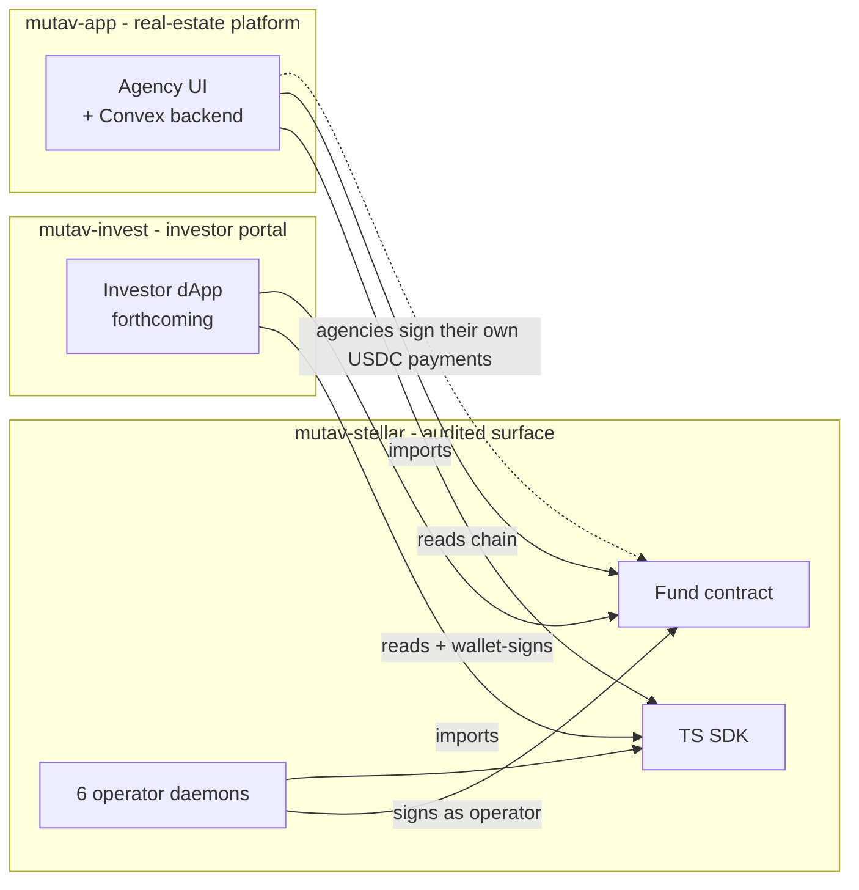
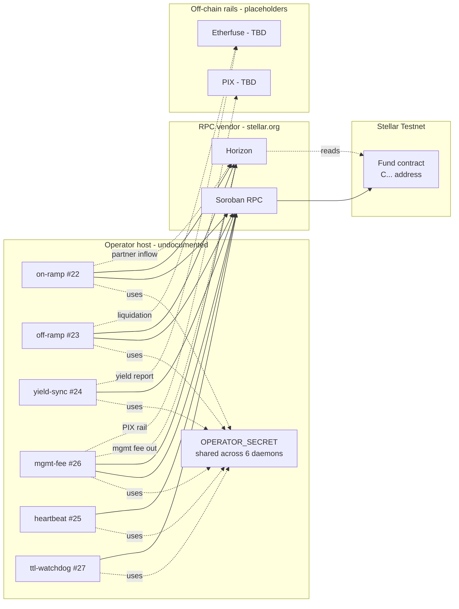
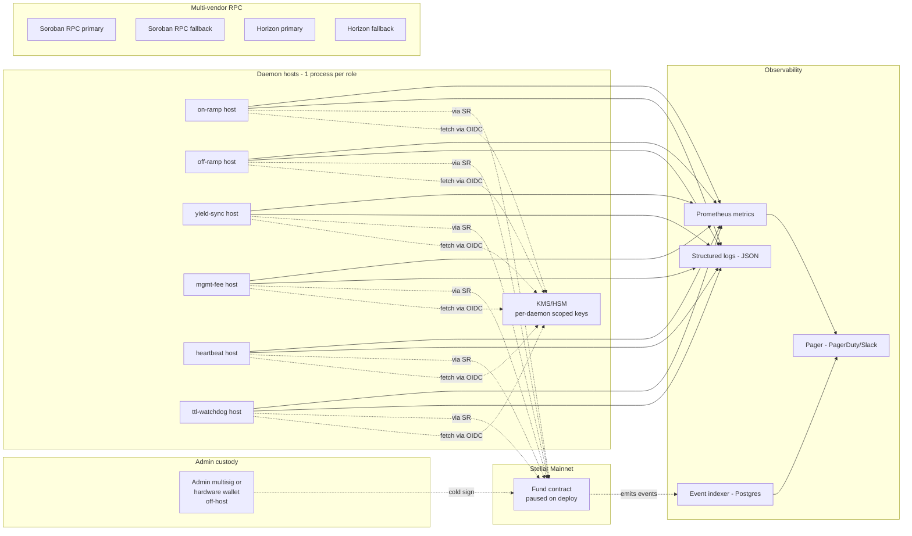

# 07 — Deployment topology

Where things run, today and in the target state. The current topology is testnet-grade; the mainnet target adds isolation, redundancy, and observability.

## Cross-repo topology

Three repos, one dependency direction. Both `mutav-app` and `mutav-invest` consume this repo's SDK; neither holds operator or admin keys. **Operator-key custody belongs with the contracts it authorizes — that's why the daemons live here.**

## Current (testnet, 2026-05-27)

### Current state (gaps in italic)

- **Contract**: single deployment per network. Address only in operator `.env` — *no in-repo registry* (#43).
- **Daemons**: 6 separate Bun processes, host model undocumented. *Likely single box*; restart policy ad-hoc.
- **Keys**: a single `OPERATOR_SECRET` shared by all 6 daemons (#41). Admin key custody undocumented.
- **RPC**: single vendor (`stellar.org` testnet; `validationcloud.io` mainnet). No fallback.
- **Observability**: `console.log("[name] ...")` to stdout. No metrics, no health, no indexer, no pager (#44).
- **Deploy**: manual `soroban contract deploy` from operator workstation. No CI workflow, no wasm artifact attestation, no reproducible-build check (#43).
- **Etherfuse + PIX**: API integrations are placeholder TODOs in code; not wired to a real provider yet.

## Target (pre-mainnet)

### Target state additions

- **Contract**: deployed paused on mainnet; address registry committed to `addresses/mainnet.json`; wasm hash matches CI-attested build (#43).
- **Daemons**: one process per role, each with its own scoped key fetched via KMS/OIDC. No bare-env secrets.
- **Admin**: multisig or hardware wallet held off-host. Documented custody runbook (#41).
- **RPC**: primary + fallback per role (Soroban RPC, Horizon). Daemon retries failover automatically.
- **Observability**: structured logs, Prometheus metrics, event indexer consuming Soroban events, pager wired to one channel.
- **Deploy**: GH Action triggered on signed tag. SLSA build provenance for the wasm. Mainnet deploy script reads the readiness checklist and refuses if any gate unchecked (#40).

## What the daemon hosts need

For each daemon process, the host must provide:

- A scoped secret (its piece of operator authority — see #41).
- Outbound network to Soroban RPC + Horizon (primary + fallback).
- Outbound network to Etherfuse API (when wired).
- A writable volume for any state files (cursor, ttl-watchdog state).
- A way to expose `/healthz` and `/metrics` to the observability layer (when wired).
- A restart policy that surfaces crashes to the pager (when wired).
- NTP-synced clock (clock drift breaks heartbeat math — see PR #25 review).

## Migration path

The route from current → target is staged:

1. **Foundation modules** (#36, #37, #38) land before daemon rebuild.
2. **Address registry + wasm attestation** (#43) land before mainnet contract is deployed.
3. **Key custody + KMS** (#41) lands before any production daemon runs.
4. **Observability stack** (#44) lands before mainnet contract is unpaused.
5. **Pre-mainnet checklist** (#40) is the gate.

## Known gaps

- All of issues #40, #41, #42, #43, #44 are about closing the current → target delta.
- No deployment script in repo yet (#43).
- No address registry yet (#43).
- No KMS/HSM integration (#41).
- No observability layer (#44).
- No documented runbook beyond `cover_default` (#47).
