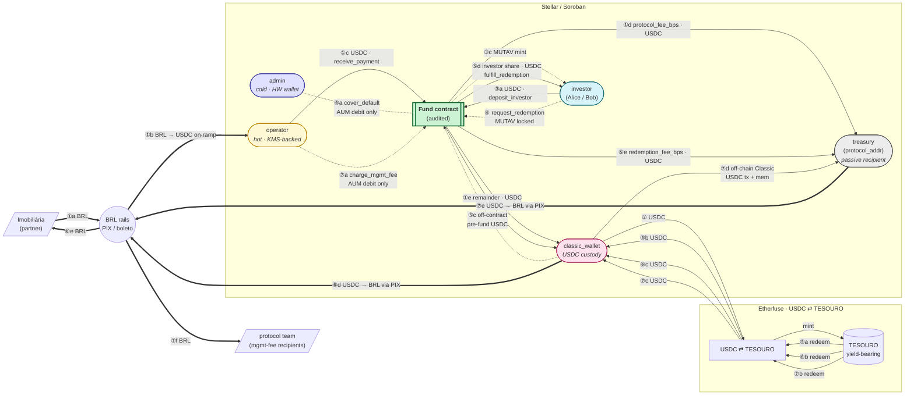

# Money flow and wallets

End-to-end map of value movement across the MUTAV `Fund` contract. Numbered legs cross-reference the canonical flows in [`06-canonical-flows.md`](../06-canonical-flows.md); wallet roles are defined in [`02-actors-and-trust.md`](../02-actors-and-trust.md).

## Legend

| Visual          | Meaning                                                                                              |
| --------------- | ---------------------------------------------------------------------------------------------------- |
| `==>` thick     | Off-chain BRL flow (PIX / boleto / bank rails)                                                       |
| `-->` solid     | On-chain USDC transfer inside a Soroban tx                                                           |
| `-.->` dotted   | Pure accounting (AUM debit, MUTAV mint / burn, off-chain Classic tx, off-chain hand-offs)            |
| `((  ))` circle | BRL rail (system boundary)                                                                           |
| `[[  ]]` double | Soroban contract                                                                                     |
| `([  ])` round  | Stellar account / wallet                                                                             |

## Per-leg notes

### ① Partner inflow — `receive_payment`

Imobiliária pays the monthly guarantee fee in BRL to the MUTAV bank account. The operator on-ramps the BRL into USDC, then submits `receive_payment(imobiliaria, amount_usdc, tx_hash)`. The contract pulls USDC from the operator wallet, splits `protocol_fee_bps` to `treasury` (`protocol_addr`), and forwards the remainder to `classic_wallet` (which increments AUM). A replay guard rejects duplicate `tx_hash` for 7 days.

### ② TESOURO conversion

Outside the contract — `classic_wallet` sends USDC to Etherfuse and receives TESOURO. All AUM lives as TESOURO between cycles; the contract holds no USDC at rest.

### ③ Investor deposit — `deposit_investor`

Investor authorizes USDC transfer into the contract; the contract forwards it to `classic_wallet` and mints MUTAV to the investor at the current NAV (`aum / supply`). Net USDC residence inside the contract is zero.

### ④ Investor requests redemption — `request_redemption`

Investor's MUTAV is locked (debited from balance, recorded as `PendingRedemption`) and pushed onto the redemption queue. No USDC moves.

### ⑤ Redemption fulfillment

A three-step process spanning chain + off-chain:

1. **`process_redemptions`** (operator, weekly) — pure accounting. The contract walks the queue, computes each entry's `usdc_gross` at current NAV, burns MUTAV, debits AUM, and writes `ReadyRedemption` entries with a `deadline` (`fulfill_window_seconds`).
2. **Off-contract pre-fund** — `classic_wallet` redeems TESOURO at Etherfuse, then transfers the matching USDC into the Fund contract address. *This transfer requires `classic_wallet` to sign and is the only operationally critical signing role for `classic_wallet`.*
3. **`fulfill_redemption(investor)`** (operator) — transfers `usdc_gross − fee` to the investor and `fee` (`redemption_fee_bps`) to `treasury`.

If the operator misses the `deadline`, the investor can call `reclaim_expired_redemption` to recover the locked MUTAV (no USDC moves on reclaim — AUM is credited back).

### ⑥ Cover default (sinistro) — `cover_default`

Pure on-chain accounting: admin debits AUM and logs the `destination` for audit (`destination` does *not* receive on-chain USDC). The actual BRL payout to the imobiliária's bank account happens off-chain: `classic_wallet` redeems TESOURO → USDC → BRL via PIX → imobiliária.

### ⑦ Management fee — `charge_mgmt_fee`

Pure on-chain accounting: AUM is debited by `aum × mgmt_fee_bps / 10000`. The 30-day interval is contract-enforced. The actual transfer to `treasury` happens off-chain via a Classic Stellar USDC transfer (with memo, which Soroban cannot produce). Onward distribution to the protocol team is BRL via PIX, handled by `mutav-app`.

The same pattern applies to **`record_offchain_payout`** (operator) — AUM is debited and the destination is logged, mirroring an off-chain wire that already happened.

## What the diagram leaves out

- **`sweep_usdc`** — moves any idle USDC sitting in the contract back to `classic_wallet`. AUM is not changed. Issue [`#28`](https://github.com/mutav-finance/mutav-stellar/issues/28) flags the missing reserve check.
- **`add_yield` / `add_tenant_fee`** — pure AUM credit; reflects off-chain TESOURO appreciation. No USDC moves.
- **`extend_ttl` / TTL-watchdog** — bookkeeping for instance + per-investor storage. Not a value flow.
- **`set_*` admin parameter changes** — governance, not money.
- **SEP-41 `transfer` / `approve` between investors** — the MUTAV token honors SEP-41, but secondary-market flows are out of scope here.

## Open question: `classic_wallet` keypair custody

The trust model in [`02-actors-and-trust.md`](../02-actors-and-trust.md) names `admin`, `operator`, and `treasury` keypair custody but does not pin `classic_wallet`'s. Leg ⑤c (off-contract pre-fund) and the off-chain payouts in ⑥ + ⑦ all require `classic_wallet` to sign. A follow-up should either (a) document `classic_wallet` as another KMS-backed Convex Action key, or (b) place it elsewhere with an explicit rationale.
